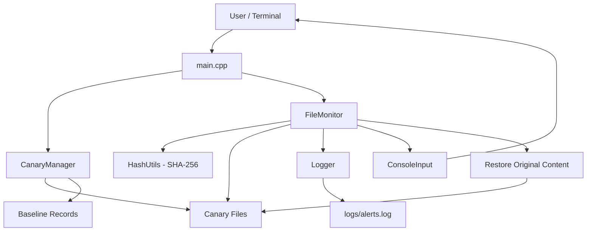
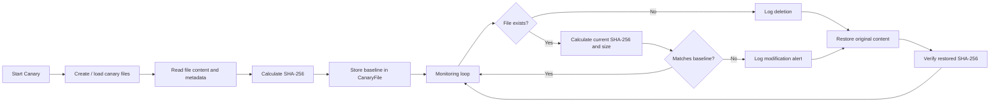
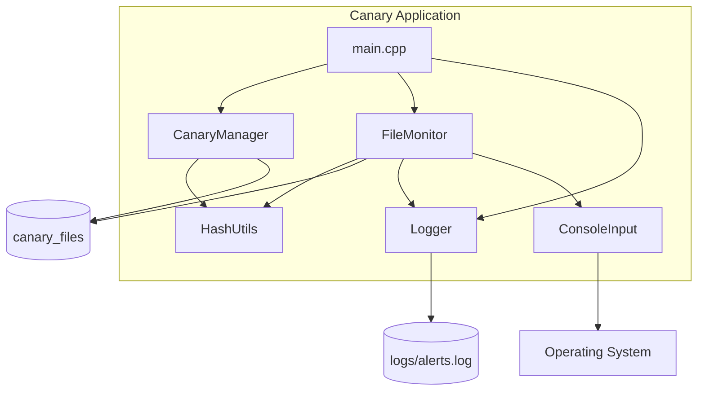
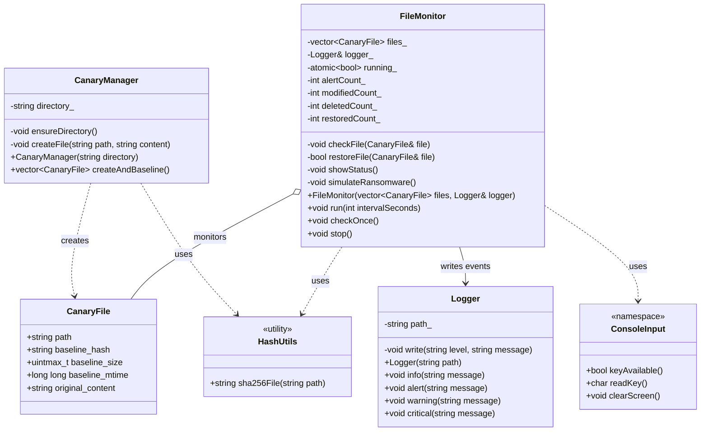
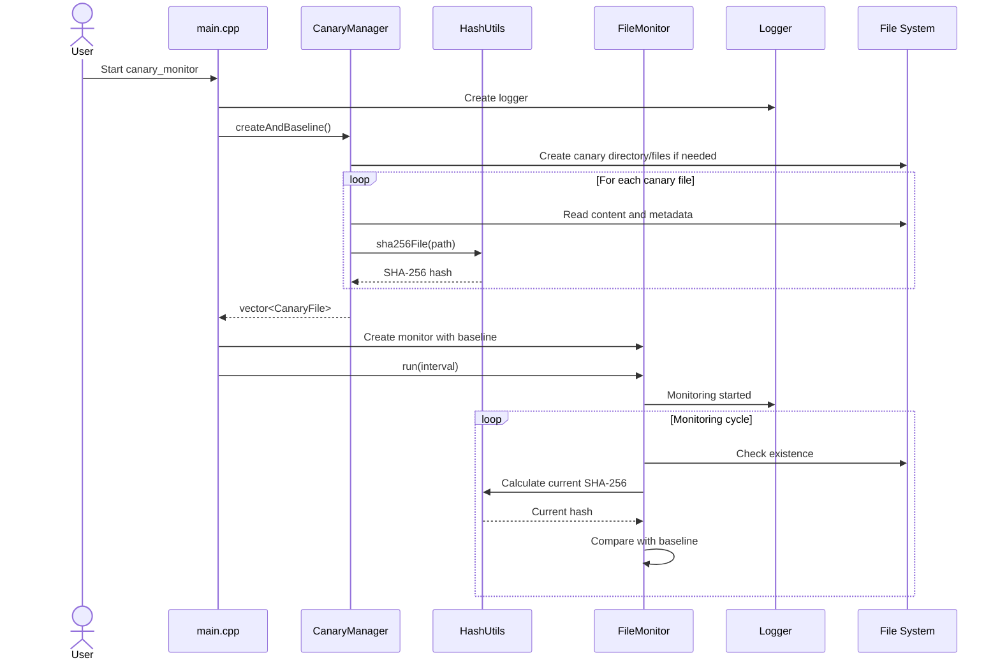
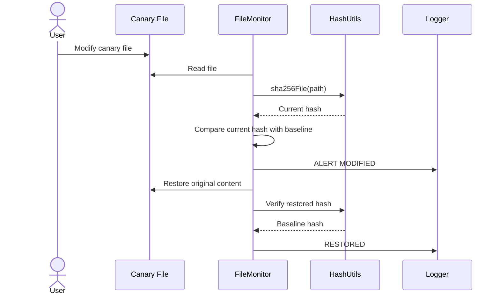
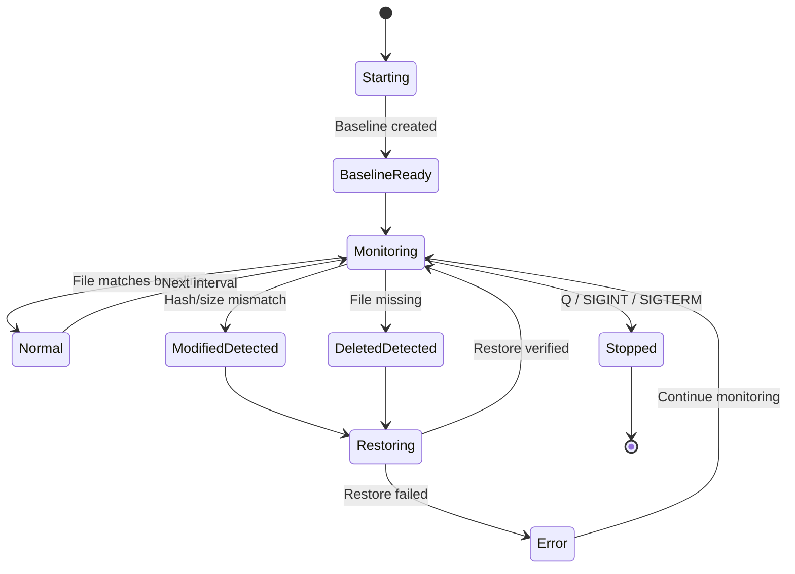
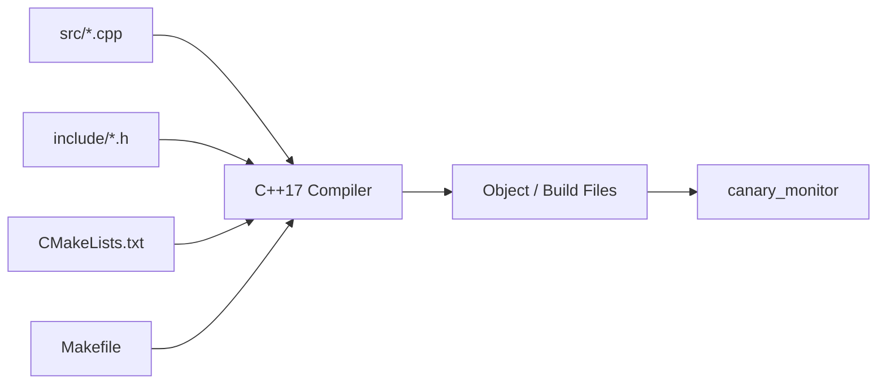

# Canary — System Architecture and UML

## 1. System Overview

Canary is a C++17 host-based file-integrity monitoring application. It creates or loads a small set of canary files, calculates SHA-256 baseline hashes, periodically checks the files, logs integrity events, and restores the original content when a canary file is modified or deleted.

The implementation is organized around five main responsibilities:

- `main.cpp` — application startup, command-line arguments, logger/manager creation, signal handling, and monitor startup.
- `CanaryManager` — creates the canary directory/files and builds the initial baseline records.
- `FileMonitor` — periodically checks canary files, detects modification/deletion, performs restoration, displays status, and handles the safe test simulation.
- `HashUtils` — calculates SHA-256 hashes.
- `Logger` — writes timestamped security/application events to the log and console.
- `ConsoleInput` — isolates interactive keyboard/screen handling between Windows and Linux.

## 2. High-Level Architecture

## 3. Runtime Data Flow

## 4. Component Diagram

## 5. UML Class Diagram

## 6. UML Sequence Diagram — Normal Startup

## 7. UML Sequence Diagram — Modification Detection and Recovery

## 8. State Diagram

## 9. Main Data Structure

`CanaryFile` is the central record used by the monitor. It contains:

| Field | Purpose |
|---|---|
| `path` | Path of the monitored canary file |
| `baseline_hash` | Known-good SHA-256 value |
| `baseline_size` | Known-good file size |
| `baseline_mtime` | Baseline modification-time value |
| `original_content` | Content used for recovery |

`FileMonitor` stores a `vector<CanaryFile>` and checks each record during every monitoring cycle.

## 10. Platform Boundary

Most of the application uses portable C++17 facilities such as `std::filesystem`, streams, containers, threads, atomics, and standard signal handling.

Platform-specific terminal behavior is isolated in `ConsoleInput.cpp`:

- Windows uses `_kbhit()` / `_getch()` and Windows console APIs.
- Linux uses `select()`, `termios`, `read()`, and ANSI terminal control.

Time conversion is also separated with the platform-specific `localtime_s` / `localtime_r` calls in `Logger.cpp`.

## 11. Build Architecture

